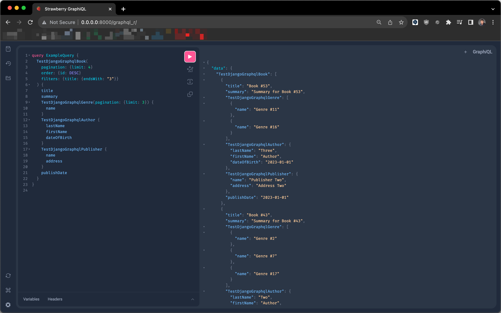

## Автоматический GraphQL api интерфейс <br>для всех моделей любого Django проекта

*Пакеты: __django, strawberry и django-strawberry__<br>\* потребуется __docker__ и __docker-compose__*

#### Запуск приложения

```shell
docker-compose up --build
```

Теперь сервер должен быть доступен.<br>
Для тестирования GraphQL запросов перейдите на:
- Один уровень вложения http://0.0.0.0:8000/graphql/
- Рекурсивное вложение http://0.0.0.0:8000/graphql_r/

#### Пример запроса

```
query ExampleQuery {
  TestDjangoGraphqlBook(
    pagination: {limit: 4}
    order: {id: DESC}
    filters: {title: {endsWith: "3"}}
  ) {
    title
    summary
    TestDjangoGraphqlPublisher {
      name
      address
    }
    publishDate
    TestDjangoGraphqlAuthor {
      lastName
      firstName
      dateOfBirth
    }
    TestDjangoGraphqlGenre(pagination: {limit: 3}) {
      name
      TestDjangoGraphqlBook(pagination: {limit: 3}) {
        title
        summary
      }
    }
  }
  TestDjangoGraphqlGenre(pagination: {limit: 10}) {
    name
    TestDjangoGraphqlBook(pagination: {limit: 5}) {
      TestDjangoGraphqlAuthor {
        firstName
        lastName
        dateOfBirth
      }
      title
      publishDate
    }
  }
}
```
